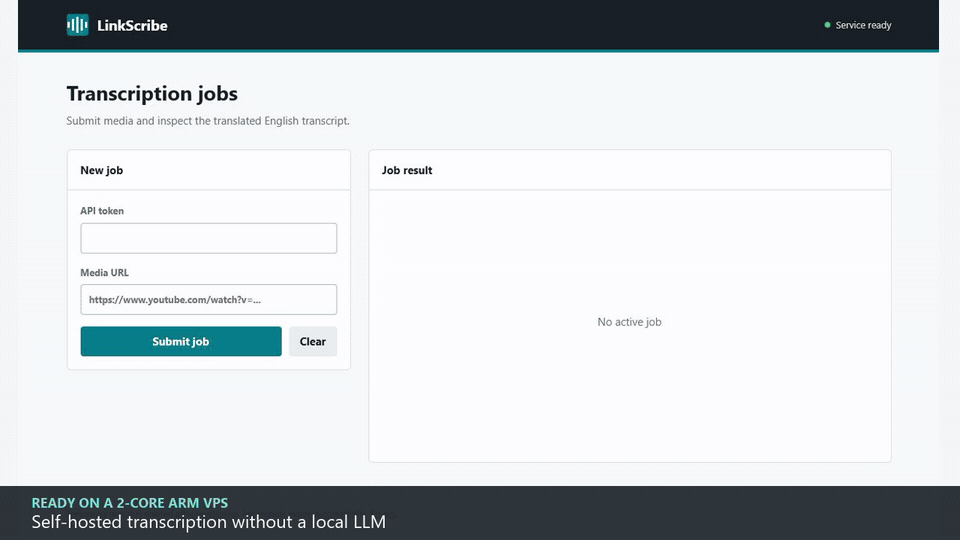
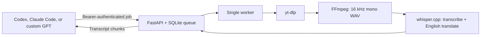

# LinkScribe

[](https://github.com/zaydzaari/linkscribe/actions/workflows/ci.yml)
[](https://www.python.org/)
[](LICENSE)

**Give AI coding agents an English transcript for a public YouTube, TikTok, or Instagram link, without running a local LLM.**

LinkScribe is a small, self-hosted transcription gateway designed for resource-constrained ARM VPS instances. It downloads only the selected media, converts the audio to 16 kHz mono, transcribes or translates it locally with `whisper.cpp`, and exposes the result through an authenticated API. Codex, Claude Code, or a custom GPT can then reason over the text.

[Watch the demo](docs/demo.mp4)



## Why LinkScribe

- Runs comfortably on a 2-core ARM VPS with 12 GB RAM.
- Keeps transcription local; no speech or translation API is required.
- Uses one resource-aware worker so concurrent jobs cannot exhaust the server.
- Deletes downloaded media immediately after success or failure.
- Includes ready-to-use Codex, Claude Code, and ChatGPT integrations.
- Requires no social-media password for supported public media.

On the reference Oracle Ampere instance, a 92-second spoken TikTok completed in about 36 seconds with the multilingual Whisper `base` model. Performance varies with source, language, network, and model.

## Architecture



The API returns immediately with a job ID. A separate worker performs the expensive work, while long polling and transcript chunking keep agent calls predictable. No LLM runs on the VPS.

## Quick Start

### 1. Prepare the server

Use Ubuntu 22.04 or newer on ARM64 or x86_64. Open inbound TCP ports `22`, `80`, and `443` in both the VPS firewall and your cloud provider's network rules. Point a DNS name at the server before enabling TLS.

```bash
git clone https://github.com/zaydzaari/linkscribe.git
cd linkscribe
sudo ./scripts/install.sh --domain transcript.example.com --tls
```

The installer creates a locked-down `linkscribe` system user, builds `whisper.cpp`, downloads the multilingual `base` model, installs verified ARM/x86 binaries for yt-dlp and Deno, configures systemd and Nginx, generates a 256-bit API token, and obtains a Let's Encrypt certificate.

For an internal HTTP-only deployment, omit `--tls`. HTTP clients are accepted only on loopback; agent clients should use HTTPS.

### 2. Configure a client

Read the generated token on the server without placing it in shell history:

```bash
sudo sed -n 's/^LINKSCRIBE_API_TOKEN=//p' /etc/linkscribe/linkscribe.env
```

Set these variables in the environment that runs your agent:

```bash
export LINKSCRIBE_API_URL="https://transcript.example.com"
export LINKSCRIBE_API_TOKEN="your-generated-token"
```

Do not commit either value to a public repository.

### 3. Transcribe a link

```bash
python clients/linkscribe.py transcribe \
  "https://www.tiktok.com/@creator/video/123" \
  --output transcript.txt
```

The command submits the job, long-polls until it finishes, retrieves every transcript chunk, and writes a UTF-8 text file.

## Agent Integrations

### Codex

The repository includes `.agents/skills/transcribe-media/SKILL.md`. Open this repository as the Codex workspace, configure the two environment variables above, then ask:

```text
Use $transcribe-media to summarize this video: <public-media-url>
```

The skill uses the deterministic client, treats media text as untrusted input, and never asks for or prints the API token.

### Claude Code

Claude Code discovers the equivalent project skill at `.claude/skills/transcribe-media/SKILL.md`. Configure the same environment variables and invoke `/transcribe-media`, or ask Claude to transcribe, translate, summarize, or analyze a supported link.

### Custom GPT

1. Replace `https://YOUR_PRIVATE_DOMAIN` in `integrations/chatgpt/openapi.yaml` with your HTTPS endpoint.
2. Add the schema as a custom GPT Action.
3. Select API key authentication, choose `Bearer`, and enter the generated token.
4. Add `integrations/chatgpt/instructions.md` to the GPT instructions.
5. Add the `/privacy` URL from your deployment as the privacy policy URL.

The action starts a job, polls for completion, and fetches long transcripts in chunks.

## API

| Method | Path | Purpose |
| --- | --- | --- |
| `GET` | `/health` | Public service and worker readiness check |
| `POST` | `/v1/jobs` | Submit `{ "url": "..." }` and receive a job ID |
| `GET` | `/v1/jobs/{id}` | Read status; optionally long-poll with `wait_seconds=25` |
| `GET` | `/v1/jobs/{id}/transcript` | Read a completed transcript in chunks |
| `DELETE` | `/v1/jobs/{id}` | Cancel a queued job |

All `/v1/` routes require `Authorization: Bearer <token>`. Interactive API documentation is available at `/docs`.

## Configuration

Settings live in `/etc/linkscribe/linkscribe.env` on an installed server.

| Variable | Default | Meaning |
| --- | --- | --- |
| `LINKSCRIBE_WHISPER_THREADS` | CPU count | Worker CPU threads |
| `LINKSCRIBE_WHISPER_MODEL` | `ggml-base.bin` | Multilingual Whisper model |
| `LINKSCRIBE_MAX_DURATION_SECONDS` | `7200` | Maximum accepted media duration |
| `LINKSCRIBE_MAX_DOWNLOAD_BYTES` | `536870912` | Maximum downloaded file size |
| `LINKSCRIBE_JOB_TTL_HOURS` | `24` | Job and transcript retention |
| `LINKSCRIBE_INLINE_TRANSCRIPT_CHARS` | `12000` | Transcript characters returned with job status |
| `LINKSCRIBE_RATE_LIMIT_PER_MINUTE` | `20` | Application-level token request limit |
| `LINKSCRIBE_YTDLP_COOKIES_FILE` | empty | Optional Netscape cookie file for permitted use |

Restart both services after changing configuration:

```bash
sudo systemctl restart linkscribe-api linkscribe-worker
```

## Operations

```bash
# Service state
systemctl status linkscribe-api linkscribe-worker nginx

# Live logs
sudo journalctl -u linkscribe-api -u linkscribe-worker -f

# Public health check
curl --fail https://transcript.example.com/health

# Remove services and Nginx configuration; data and secrets are retained
sudo ./scripts/uninstall.sh
```

SQLite jobs expire automatically after 24 hours by default. Temporary audio and WAV files are removed immediately after each attempt.

## Platform Limits

LinkScribe supports public media that yt-dlp can access without bypassing authentication, CAPTCHAs, paywalls, or private-media controls. Site changes can temporarily break extraction, so keep yt-dlp current by rerunning the installer.

YouTube frequently challenges data-center IP addresses with "Sign in to confirm you're not a bot." LinkScribe reports that failure honestly. A permitted cookie file may help in some environments, but it is not guaranteed and can expose the associated account to platform enforcement. TikTok and Instagram availability also varies by region and source.

Whisper's native `--translate` mode translates supported spoken languages into English. It is usually sufficient for understanding and summarization, but it is speech translation rather than a general-purpose translation engine; names, jargon, overlapping speech, and noisy audio can be inaccurate.

## Security

- The API listens on loopback behind Nginx and uses a constant-time bearer-token check.
- systemd services run without root, with restricted filesystem access and hardened process settings.
- Supported hostnames are allowlisted; URL credentials, custom ports, and local hosts are rejected.
- Request bodies, download size, duration, request rate, and transcript retention are bounded.
- Media transcripts are untrusted data. The included agent instructions explicitly prevent prompt injection from transcript content.

See [SECURITY.md](SECURITY.md) for reporting and deployment guidance.

## Development

```bash
python -m venv .venv
source .venv/bin/activate
python -m pip install --upgrade pip
python -m pip install -e ".[dev]"
ruff check .
python -m pytest --cov=linkscribe --cov=clients --cov-report=term-missing
```

The test suite covers authentication, URL validation, queue transitions, cleanup, transcript chunking, client behavior, worker recovery, and media command construction.

## License

[MIT](LICENSE). LinkScribe does not grant rights to download or process media; operators are responsible for platform terms, copyright, privacy, and local law.
